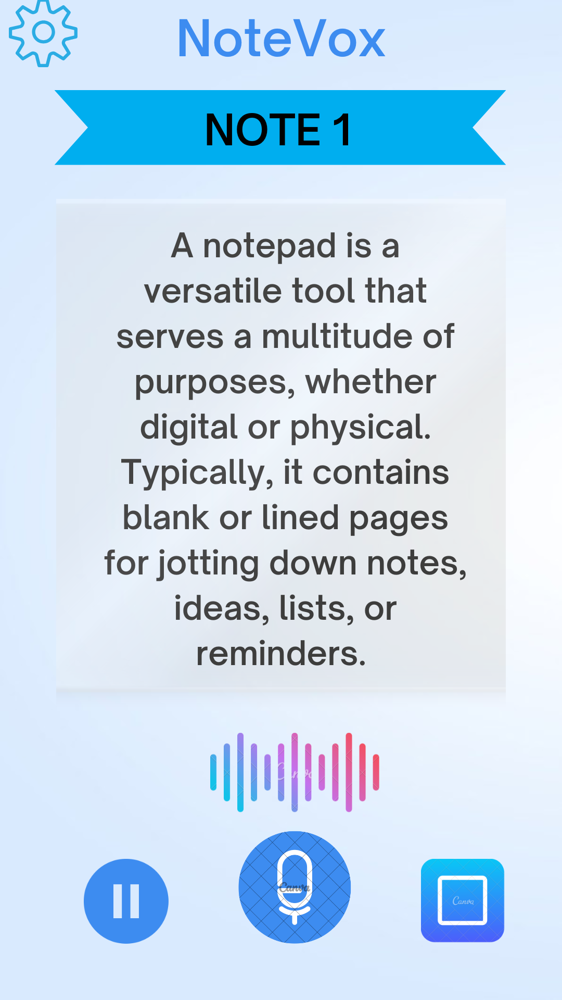

# Smart Notepad with Voice Commands

## Description
A simple notepad application for Android that allows users to create, edit, and delete notes. Includes voice command functionality for hands-free interaction.

## Features
- Create, edit, and delete notes.
- Add notes using voice commands.
- Open specific notes via voice search.
- Delete notes using voice commands.

## Technologies Used
- Language: Java
- Database: SQLite (or Room)
- Voice Recognition: Google Voice API

  # App Screenshot

  
 

This is the screens of the Smart Notepad app where users can view and manage their notes.

